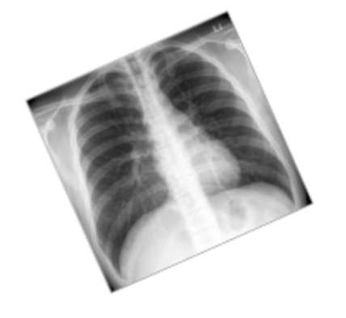

# Disease Detection with Computer Vision

1. Which of the following is not one of the key challenges for AI diagnostic algorithms that is discussed in the lecture?
    - Inflexible Models
2. You find that your training set has 70% negative examples and 30% positive. Which of the following techniques will NOT help for training this imbalanced dataset?  
    - Oversampling negative examples
3. What is the total loss from the normal (non-mass) examples in this example dataset? 
    - 1.27
4. What is the typical size of medical image dataset?
    - 10 thousand to 100 thousand  images
5. Which of the following data augmentations would be best to apply?
    - 
6. Which of the following are valid methods for determining ground truth?  Choose all that apply.
    - Confirmation by CT scan
    - Consensus voting from a board of doctors
    - Biopsy
7. In what order should the training, validation, and test sets be sampled?
    - Test, Validation, Training
8. Why is it bad to have the same patients in both training and test sets?
    - Overly optimistic test performance
9.  Let’s say you have a relatively small training set (~5 thousand images). Which training strategy makes the most sense? 
    - Retraining the last layer of a pre-trained model
10. Now let’s say you have a very large dataset (~1 million images). Which training strategies will make the most sense?
    - Training a model with randomly initialized weights 
    - Retraining the last layer of a pretrained model