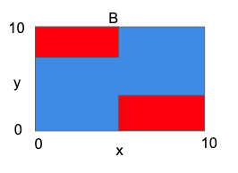

# Decision Trees, Missing Data and Imputation

1. Which decision boundary corresponds to the following decision tree?
   - 

2. True or False: A tree of depth 1 is more expressive than a classical linear model.  
   - False (_A tree of depth 1 is less expressive than a classical linear model. A tree of depth 1 can only make one decision based on the input, whereas a linear model can make multiple decisions based on the input by using multiple parameters._)

3. One way to aggregate predictions from multiple trees is by a majority vote. Using this aggregation rule, select the prediction of the following trees on the data point (x=4, y=7, z=2):   
   - Low risk

4. You’ve fit a random forest of 10 trees with max depth 20. Your training ROC is 0.99 and test ROC is 0.54. Which of the following is NOT a reasonable thing to try?  
   - Increasing the max depth 

5. When is complete case analysis least likely to bias your model? 
   - Data is missing completely at random 

6. You have created a model using mean imputation. At test time, you should fill in missing values with:  
   - Mean from the train data 

7. Let’s say blood pressure (BP) measurements are more likely to be missing among young people, who generally have lower blood pressure. You use mean imputation to train your model. Which option correctly characterizes the mean BP (after imputation) in your training dataset?  
   - It is higher than the true mean 

8. You have trained the following tree and want to make a prediction on someone, but all you know is they are 40 years old, and do not have their blood pressure. From you dataset, you learn the linear relationship between blood pressure and age is: BP=1.7×Age+60.  Using regression imputation, and the decision tree shown here, what is your prediction for this person's risk of heart attack? 
   - Low Risk (_1.7*40+60=128, which is less than 60_)

9. Assume you have missing data on one of your features, and are considering two options: Option 1: Drop the feature that has missing values and fit a linear regression on the remaining features. Option 2: Use imputation on the feature that has missing values, and fit a linear regression on all features. True or False: "Both options have the same performance".
    - False (_The performance of the two options will depend on the underlying characteristics of the dataset and the specific imputation method used._)
