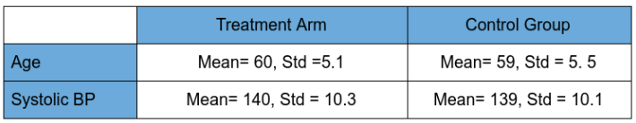

# Measuring Treatment Effects

1. Given the following statistical information of patients for a treatment arm and a control group, which one corresponds to a correct setup of a randomized control trial?
   - 

2. You are part of a medical team trying to create an alternative treatment for patients with lung cancer. Your group performs several experiments and reports results with the following p-values. Which has the most statistically significant result?
   - p-value = 0.0001

3. Given an average risk reduction (ARR) of 0.2, on average, how many people need to receive the treatment in order to benefit one of them (NNT)?
   - 5

4. You are studying the effect of a new treatment for heart attack, your job consists in looking at outcomes of the effect in patients, fill the unit level treatment effect column using the Neyman-Rubin causal model, and then calculate the average treatment effect.
   - 0.375

5. Calculate the conditional average treatment effect applying the Two-Tree Learner method, the patient has an Age=61 and BP= 130.
   - -0.20

6. Using the S-Learner, or Single Tree, method, what is the conditional average treatment effect for a 61 year-old patient with a blood pressure (BP) of 140?
   - We can’t estimate the conditional ATE using this S-Learner. 

7. Which considerations are relevant to the S-Learner Method? Choose all that are correct.
   - This model might produce a treatment effect estimate of 0 for everyone. 
   - The Decision Tree might decide not to use the treatment feature.

8. Which considerations are relevant to the T-Learner Method? Choose all that are correct.
   - Since the two models are using each half of the data, there are fewer samples available to learn the relationships between the features.