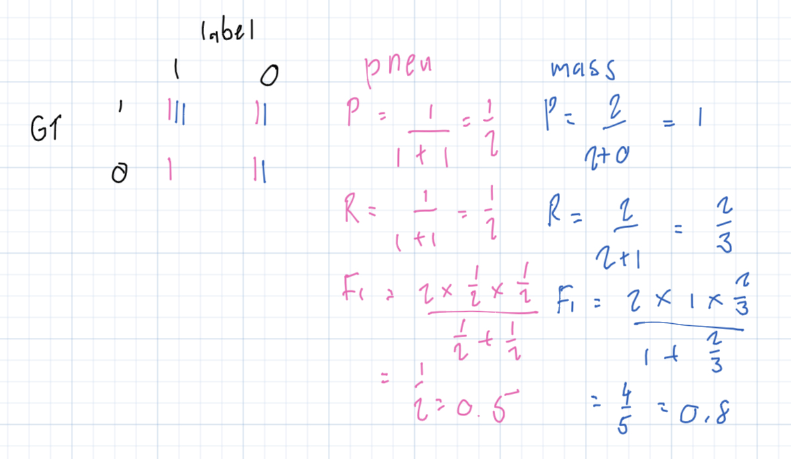
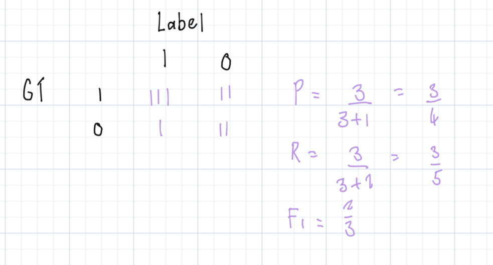

# Information Extraction with NLP

1. Which of the following is not true about BERT’s inner word representations? 
   - Each unique word can have exactly one vector representation (_"Each unique word can have exactly one vector representation" is not true about BERT's inner word representations. BERT uses subword tokenization, which means that it can represent a word by a combination of multiple subword token vectors. So a unique word can have multiple vector representations depending on the context._)

2. True or False: the start and end vectors are fixed throughout training 
   - False

3. Which of the following is a difference between BERT and LSTM models? 
   - BERT takes entire sequences as input, while LSTM models process words one by one (_While BERT takes an entire sentence or sequence as input and learns the context by attending to all the words, LSTMs process words one by one and maintain a hidden state to remember the context of the previous words._)

4. Given the following word vectors and start and end vectors, determine the start and end of the sequence of interest.
   - start: breast, end: cancer

5. You find that a radiology report mentions “edema”. Which of the following can you immediately conclude? 
   - None of the above (_It could state "No edema..."_)

6. Use the following entry in SNOMED CT to help determine the positive labels for this x-ray report.
   - common cold: 1, lesion: 0

7. Let’s see why F1 is used instead of the regular mean of precision and recall. Let’s say the mean of precision and recall is at least 0.75. Which of the following could be the true value of the precision? 
   - Both

8. Now let’s say F1 score is at least 0.75. Now which of the following values of precision are possible? 
   - 0.75

9. Compute the F1 score for pneumonia and mass separately based on the following retrieved labels and ground truth:
    - (0.5, 0.8)
    

10. Now compute the F1 score for all labels jointly: 
    - 0.66
    
